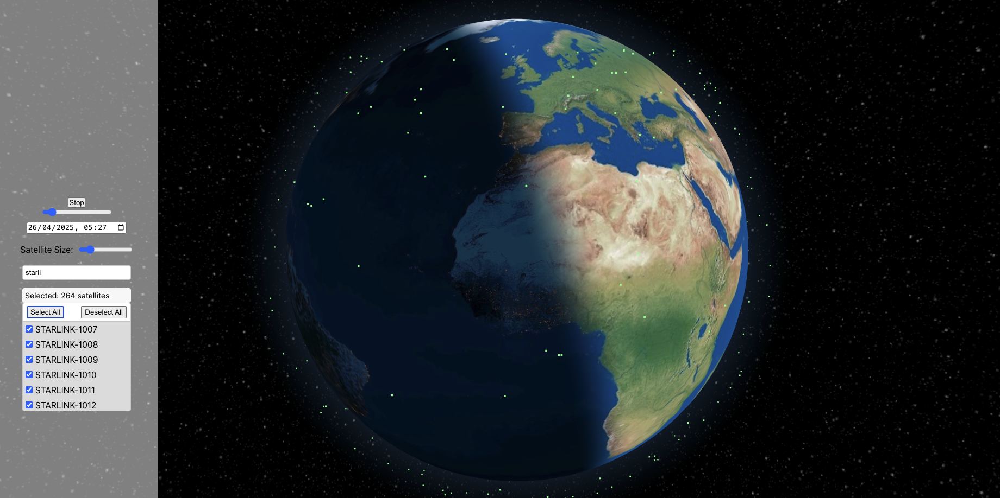

*An interactive 3D globe showing real-time satellite positions and day/night shading.*

# Satellite Image Invite

A real-time 3D visualization of Earth and satellite tracking application built with React and Three.js. This interactive globe allows users to track satellites in real-time, visualize their orbits, and explore the Earth's day/night cycle.

## Features

- 🌍 Interactive 3D Earth visualization with day/night cycle
- 🛰️ Real-time satellite tracking
- ⏰ Time control to view satellite positions at different times
- 🔍 Search and filter satellites
- 🎮 Adjustable rotation speed and satellite size
- 🌙 Realistic Earth textures with day/night shader

## Technologies Used

- React
- Three.js
- react-globe.gl
- satellite.js
- TypeScript

## Getting Started

### Prerequisites

- Node.js (v14 or higher)
- npm or yarn

### Installation

1. Clone the repository:
```bash
git clone https://github.com/yourusername/satellite-image-invite.git
cd satellite-image-invite
```

2. Install dependencies:
```bash
npm install
```

3. Start the development server:
```bash
npm start
```

The application will open in your default browser at [http://localhost:3000](http://localhost:3000).

## Usage

- Use the mouse to rotate and zoom the globe
- Click the "Start/Stop" button to control Earth's rotation
- Adjust the rotation speed using the slider
- Select a date and time to view satellite positions at that moment
- Use the search bar to find specific satellites
- Adjust satellite size using the size slider

## Available Scripts

### `npm start`

Runs the app in development mode.\
Open [http://localhost:3000](http://localhost:3000) to view it in the browser.

### `npm test`

Launches the test runner in interactive watch mode.

### `npm run build`

Builds the app for production to the `build` folder.

## Contributing

Contributions are welcome! Please feel free to submit a Pull Request.

## License

This project is licensed under the MIT License - see the LICENSE file for details.
